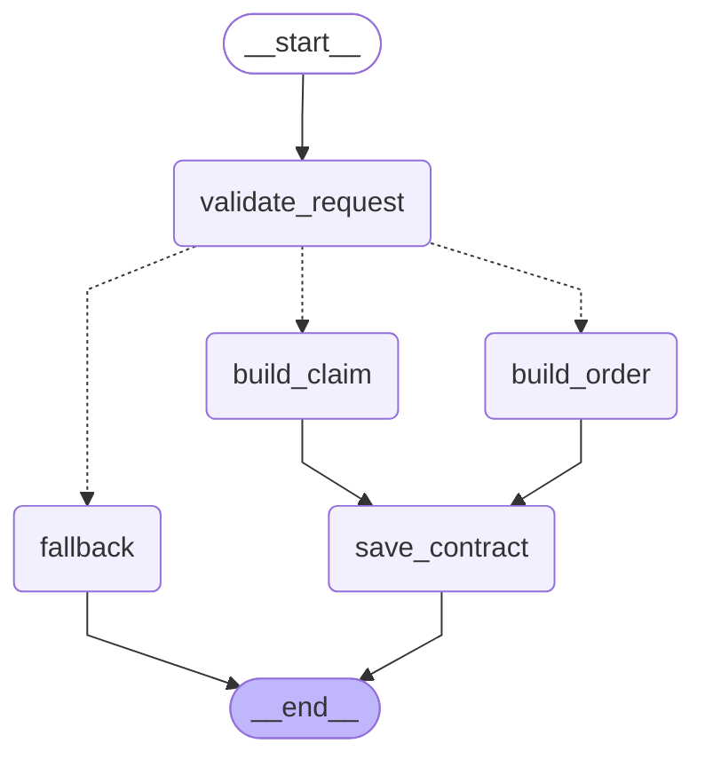

# Схема графа

```mermaid
---
config:
  flowchart:
    curve: linear
---
graph TD;
	__start__([<p>__start__</p>]):::first
	validate_request(validate_request)
	build_order(build_order)
	build_claim(build_claim)
	save_contract(save_contract)
	fallback(fallback)
	__end__([<p>__end__</p>]):::last
	__start__ --> validate_request;
	build_claim --> save_contract;
	build_order --> save_contract;
	validate_request -.-> build_claim;
	validate_request -.-> build_order;
	validate_request -.-> fallback;
	fallback --> __end__;
	save_contract --> __end__;
	classDef default fill:#f2f0ff,line-height:1.2
	classDef first fill-opacity:0
	classDef last fill:#bfb6fc

```
